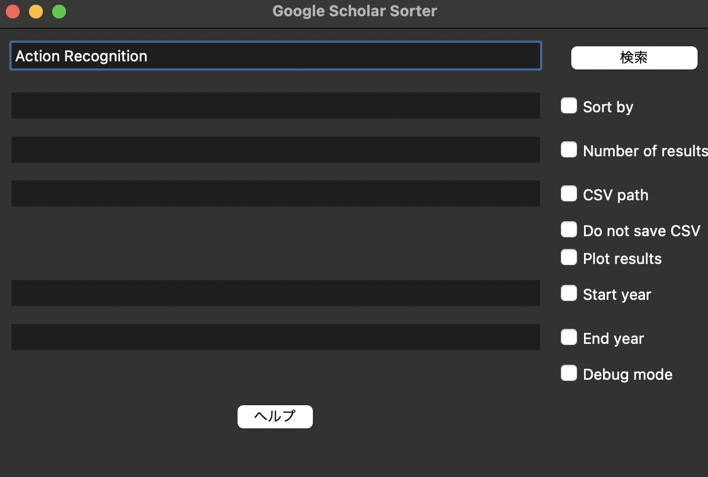

# 概要
- Google Scholarから論文検索ができるツール．
- 引用数順とかで取得できて便利！

## インストール仕方
リポジトリのクローン
```
git clone https://github.com/YumaHozumi/search-gs-ui.git
```

仮想環境作る
```
python3 -m venv venv
```
仮想環境に入る
```
source venv/bin/activate
```

ライブラリのインストール
```
pip install -r requirements.txt
```

(macの場合)多分これやらないとtkinterのエラー出る
```
brew install python-tk
```

## 実行
```
python3 main.py
```

こんな感じのウィンドウが出る！

しばらくしたらcsvファイルがディレクトリ内にできる